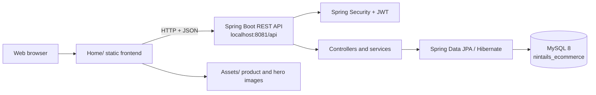
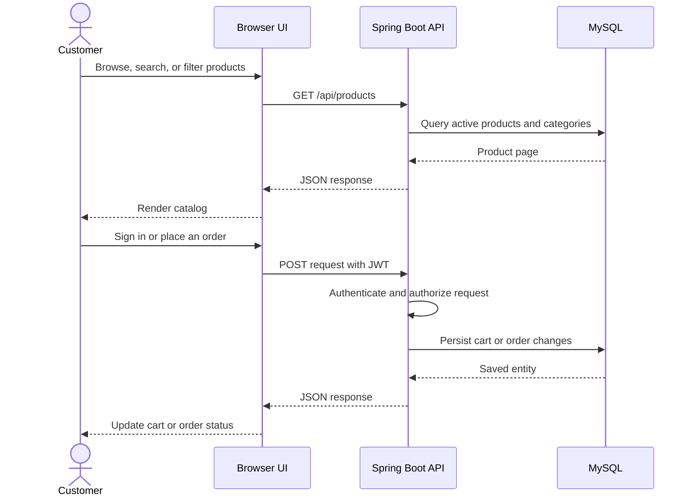
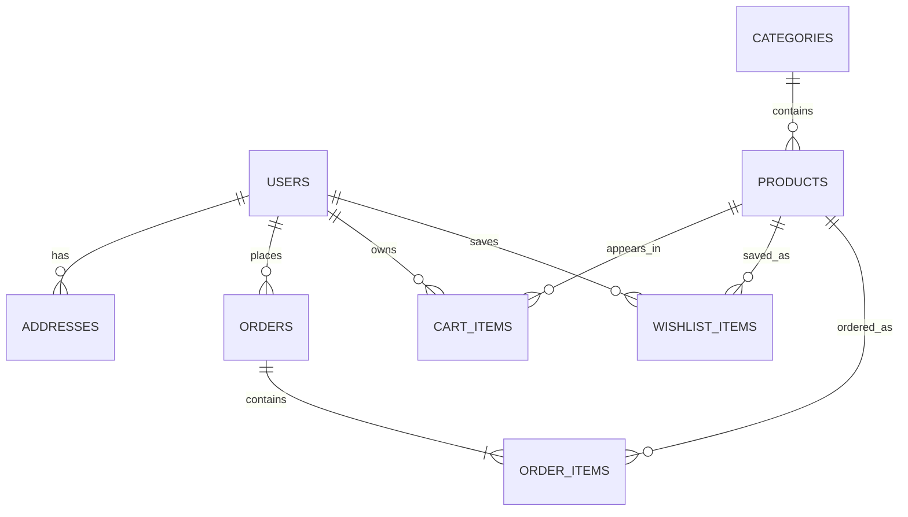

# 9Tails Ecommerce

A full-stack ecommerce web application with a vanilla HTML/CSS/JavaScript storefront and a Spring Boot REST API backed by MySQL.

Repository: https://github.com/DuddeJaitej/9Tails-Ecommerce-WebApp

## Architecture



### Request flow



### Database relationships



## Tech Stack

**Frontend**
- Vanilla HTML5, CSS3, JavaScript (no frameworks)
- Responsive design with CSS custom properties
- JWT authentication, localStorage + API hybrid data layer

**Backend**
- Spring Boot 3.2.5 + Java 21
- Spring Security + JWT (stateless)
- Hibernate / Spring Data JPA
- MySQL 8 database
- Maven 3.9

## Features

- Product catalog with categories, search, filters and ratings
- Product detail page with single image view
- Shopping cart with quantity controls
- Order placement (COD + UPI via Razorpay)
- Order tracking with 4-step shipping timeline
- Cancel / Return / Exchange order actions
- Wishlist management
- User authentication (register / login / Google OAuth)
- Admin product & category management

## Project Structure

```
Ecommerce/
├── Home/                         # Frontend pages, styles, and browser logic
│   ├── Home.html                 # Storefront and catalog
│   ├── Cart.html                 # Shopping cart
│   ├── Orders.html               # Customer orders
│   ├── OrderTracking.html        # Shipment timeline
│   ├── ProductDetail.html        # Product detail view
│   ├── api.js                    # Centralized API client
│   ├── auth.js                   # JWT and session helpers
│   ├── products-data.js          # Frontend product fallback data
│   └── *.css / *.js              # Page-specific presentation and behavior
├── Assets/                       # Product, hero, and order-support images
├── backend/
│   ├── src/main/java/com/nintails/ # REST controllers, services, entities, security
│   ├── src/main/resources/        # Spring Boot configuration
│   ├── database/schema.sql        # MySQL schema and seed data
│   └── pom.xml                    # Maven dependencies and build configuration
├── start.ps1                      # Windows launcher for MySQL, API, and frontend
└── README.md
```

## Prerequisites

- Java 21
- Maven 3.9+
- MySQL 8+
- Python 3 (used by `start.ps1` for the static frontend server)
- Git

## Download From GitHub

### Clone with Git

Open PowerShell or a terminal and run:

```powershell
git clone https://github.com/DuddeJaitej/9Tails-Ecommerce-WebApp.git
cd 9Tails-Ecommerce-WebApp
```

To download the latest changes later:

```powershell
git pull origin main
```

### Download as ZIP

1. Open the [GitHub repository](https://github.com/DuddeJaitej/9Tails-Ecommerce-WebApp).
2. Select **Code**, then choose **Download ZIP**.
3. Extract the ZIP file.
4. Open the extracted `9Tails-Ecommerce-WebApp` folder in VS Code.

Git is recommended because it makes future updates easier with `git pull`.

## Configuration

The backend reads database and JWT settings from environment variables. Set them before starting Spring Boot:

```powershell
$env:DB_PASSWORD = "your-local-mysql-password"
$env:JWT_SECRET = "a-long-random-secret-at-least-32-characters"
```

Never commit real passwords, API keys, or production JWT secrets. The checked-in configuration contains only development placeholders.

## Running Locally

### 1. Configure MySQL

Make sure MySQL is running and execute `backend/database/schema.sql` in MySQL Workbench. The script creates the `nintails_ecommerce` database, tables, sample products, and the admin account.

The backend uses these database settings:

| Setting | Value |
|---------|-------|
| Host | `localhost:3306` |
| Database | `nintails_ecommerce` |
| Username | `root` |
| Password | `$env:DB_PASSWORD` |

The application also uses JPA `ddl-auto=update` to keep tables synchronized after the database exists.

### 2. Set environment variables

Run these commands in PowerShell before starting the backend. Replace the values with your local settings:

```powershell
$env:DB_PASSWORD = "your-local-mysql-password"
$env:JWT_SECRET = "a-long-random-secret-at-least-32-characters"
```

If your local MySQL `root` account has no password, use:

```powershell
$env:DB_PASSWORD = ""
```

### 3. Start the backend

```bash
cd backend
mvn spring-boot:run
```

The API runs at `http://localhost:8081/api`.

### 4. Start the frontend

Open a second terminal in the project root and serve the static files so both `Home/` and `Assets/` resolve correctly:

```bash
python -m http.server 5500
```

Open `http://localhost:5500/Home/Home.html` in a browser. Do not open the HTML file directly with `file://`, because the frontend needs a web server for images and API requests.

### 5. Start everything on Windows

After setting the environment variables, run this from the project root:

```powershell
.\start.ps1
```

The script starts the MySQL service, Spring Boot on port `8081`, and the frontend on port `5500`. It works from any cloned repository location.

If PowerShell blocks local scripts, run:

```powershell
Set-ExecutionPolicy -Scope Process -ExecutionPolicy Bypass
.\start.ps1
```

## Application URLs

| Component | URL |
|-----------|-----|
| Storefront | http://localhost:5500/Home/Home.html |
| API base URL | http://localhost:8081/api |
| Product API | http://localhost:8081/api/products |

## API Endpoints

| Method | Endpoint | Auth | Description |
|--------|----------|------|-------------|
| POST | /auth/register | Public | Register user |
| POST | /auth/login | Public | Login, get JWT |
| GET | /products | Public | List products (paginated) |
| GET | /products/{id} | Public | Single product |
| GET | /cart | Required | Get cart |
| POST | /cart | Required | Add to cart |
| POST | /orders | Required | Place order |
| GET | /orders | Required | My orders |
| GET | /wishlist | Required | My wishlist |

## Default Credentials

| Role | Email | Password |
|------|-------|----------|
| Admin | admin@9tails.com | Admin@123 |
