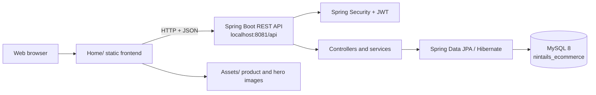
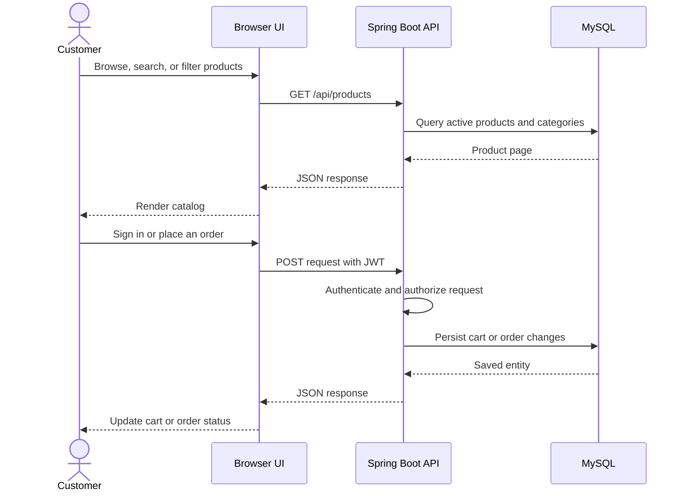
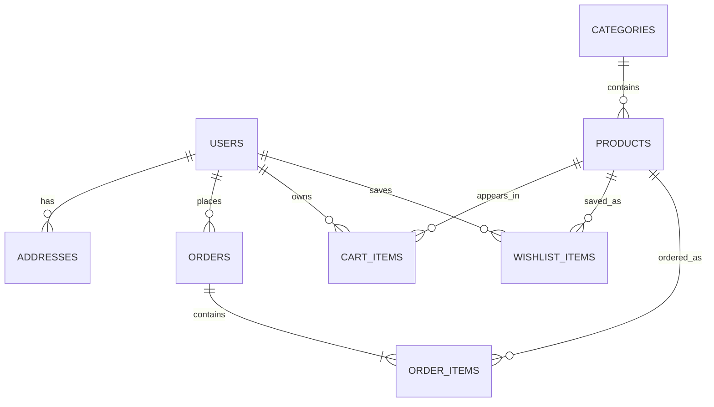

# 9Tails Ecommerce

A full-stack ecommerce web application with a vanilla HTML/CSS/JavaScript storefront and a Spring Boot REST API backed by MySQL.

Repository: https://github.com/DuddeJaitej/9Tails-Ecommerce-WebApp

## Architecture



### Request flow



### Database relationships



## Tech Stack

**Frontend**
- Vanilla HTML5, CSS3, JavaScript (no frameworks)
- Responsive design with CSS custom properties
- JWT authentication, localStorage + API hybrid data layer

**Backend**
- Spring Boot 3.2.5 + Java 21
- Spring Security + JWT (stateless)
- Hibernate / Spring Data JPA
- MySQL 8 database
- Maven 3.9

## Features

- Product catalog with categories, search, filters and ratings
- Product detail page with single image view
- Shopping cart with quantity controls
- Order placement (COD + UPI via Razorpay)
- Order tracking with 4-step shipping timeline
- Cancel / Return / Exchange order actions
- Wishlist management
- User authentication (register / login / Google OAuth)
- Admin product & category management

## Project Structure

```
Ecommerce/
├── Home/                         # Frontend pages, styles, and browser logic
│   ├── Home.html                 # Storefront and catalog
│   ├── Cart.html                 # Shopping cart
│   ├── Orders.html               # Customer orders
│   ├── OrderTracking.html        # Shipment timeline
│   ├── ProductDetail.html        # Product detail view
│   ├── api.js                    # Centralized API client
│   ├── auth.js                   # JWT and session helpers
│   ├── products-data.js          # Frontend product fallback data
│   └── *.css / *.js              # Page-specific presentation and behavior
├── Assets/                       # Product, hero, and order-support images
├── backend/
│   ├── src/main/java/com/nintails/ # REST controllers, services, entities, security
│   ├── src/main/resources/        # Spring Boot configuration
│   ├── database/schema.sql        # MySQL schema and seed data
│   └── pom.xml                    # Maven dependencies and build configuration
├── start.ps1                      # Windows launcher for MySQL, API, and frontend
└── README.md
```

## Prerequisites

- Java 21
- Maven 3.9+
- MySQL 8+
- Python 3 (used by `start.ps1` for the static frontend server)

## Configuration

The backend reads database and JWT settings from environment variables. Set them before starting Spring Boot:

```powershell
$env:DB_PASSWORD = "your-local-mysql-password"
$env:JWT_SECRET = "a-long-random-secret-at-least-32-characters"
```

Never commit real passwords, API keys, or production JWT secrets. The checked-in configuration contains only development placeholders.

## Running Locally

### 1. Database
Run `backend/database/schema.sql` in MySQL Workbench. The application also uses JPA `ddl-auto=update` to keep tables synchronized after the database exists.

### 2. Backend
```bash
cd backend
mvn spring-boot:run
```
API runs at: `http://localhost:8081/api`

### 3. Frontend
From the repository root, serve the project so both `Home/` and `Assets/` resolve correctly:

```bash
python -m http.server 5500
```

Open `http://localhost:5500/Home/Home.html`.

On Windows, `./start.ps1` starts MySQL, the backend, and the frontend together. The script assumes MySQL service `MySQL80` and the repository path configured in the script.

## Application URLs

| Component | URL |
|-----------|-----|
| Storefront | http://localhost:5500/Home/Home.html |
| API base URL | http://localhost:8081/api |
| Product API | http://localhost:8081/api/products |

## API Endpoints

| Method | Endpoint | Auth | Description |
|--------|----------|------|-------------|
| POST | /auth/register | Public | Register user |
| POST | /auth/login | Public | Login, get JWT |
| GET | /products | Public | List products (paginated) |
| GET | /products/{id} | Public | Single product |
| GET | /cart | Required | Get cart |
| POST | /cart | Required | Add to cart |
| POST | /orders | Required | Place order |
| GET | /orders | Required | My orders |
| GET | /wishlist | Required | My wishlist |

## Default Credentials

| Role | Email | Password |
|------|-------|----------|
| Admin | admin@9tails.com | Admin@123 |
